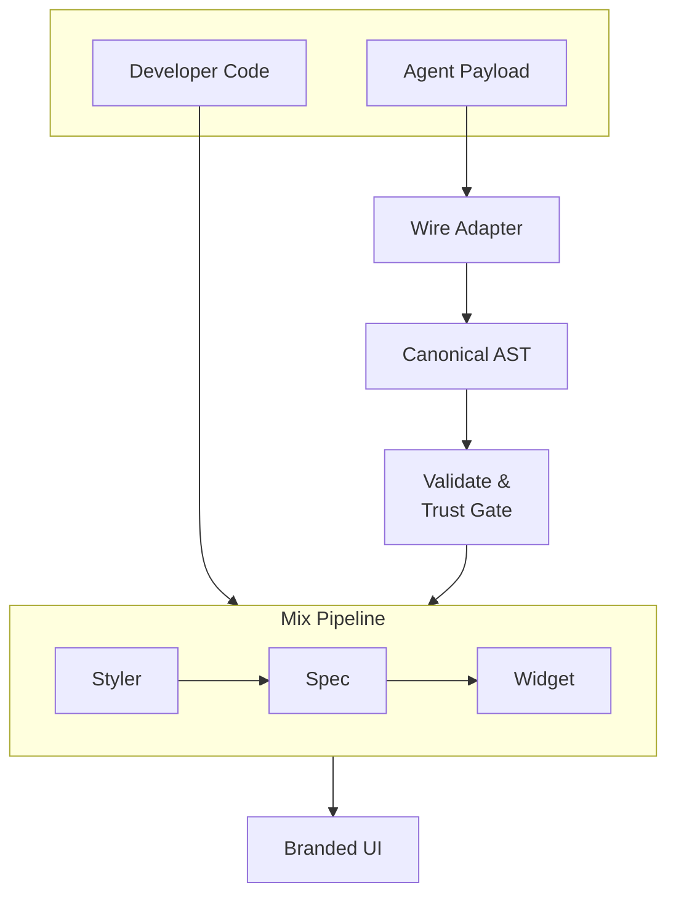
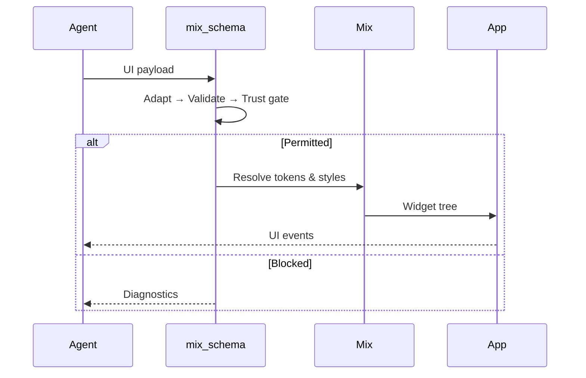

import { Callout } from "nextra/components";

# mix_schema

`mix_schema` bridges AI protocol payloads and Mix-powered Flutter UI through a deterministic, validated rendering pipeline.

## Why this exists

AI-generated UI is powerful but unstable when raw payloads are rendered directly. `mix_schema` adds structure, trust boundaries, and design-system consistency.

## Core benefits

1. Consistent output through a canonical AST.
2. Protocol change isolation through adapter boundaries.
3. Safer execution through trust and action gating.
4. Design fidelity through Mix tokens, variants, and modifiers.
5. Better debugging through deterministic diagnostics.

## Architecture

Mix already has a complete resolution pipeline that every developer uses: **Styler → Spec → Widget**. `mix_schema` feeds agent payloads into that same pipeline through an adapter layer. From the Styler onward, the path is identical.

<Callout type="info">
  The agent describes **what** to render. Mix decides **how** it looks. The user sees the same quality from both paths.
</Callout>

## Runtime flow

## Trust model

<Callout type="info">
  `mix_schema` treats validation and action policies as first-class runtime contracts, not optional checks.
</Callout>

Risk policy example:

- Low-risk actions: execute directly.
- Medium-risk actions: propose before execute.
- High-risk actions: blocked or explicit approval required.

## Related docs

- [mix_tailwinds](/documentation/ecosystem/mix-tailwinds)
- [mix_lint](/documentation/ecosystem/mix-lint)
- [mix_generator](/documentation/ecosystem/mix-generator)
- [Design Tokens](/documentation/guides/design-token)
- [Dynamic Styling](/documentation/guides/dynamic-styling)
- [Introduction](/documentation/overview/introduction)
