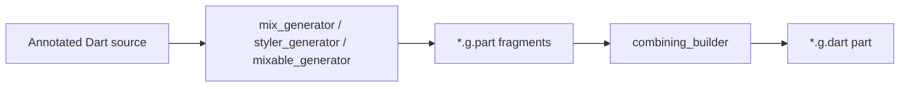

import { Callout } from "nextra/components";

# mix_generator

`mix_generator` is a [build_runner](https://pub.dev/packages/build_runner) package that generates mixins and helpers for Mix’s core types. You annotate Spec, Styler, and property (“Mix”) classes in `mix_annotations`; the builder emits part files that implement `copyWith`, `lerp`, `merge`, `resolve`, setters, and related plumbing.

## What gets generated

The package registers **three builders** (see [`build.yaml` in the mix repo](https://github.com/btwld/mix/blob/main/packages/mix_generator/build.yaml)):

| Builder | Triggers on | Generated part (suffix) | Typical mixin role |
|---------|-------------|-------------------------|-------------------|
| `mix_generator` | `@MixableSpec` | `.mix_generator.g.part` | Spec: `copyWith`, equality, `lerp`, diagnostics |
| `styler_generator` | `@MixableStyler` | `.styler_generator.g.part` | Styler: setters, `merge`, `resolve`, `props`, optional `call` |
| `mixable_generator` | `@Mixable` | `.mixable_generator.g.part` | Property Mix: `merge`, `resolve`, `props`, diagnostics |

[`source_gen`](https://pub.dev/packages/source_gen) combines these parts into your hand-authored `part '…g.dart';` library.



## Installation

Add runtime and dev dependencies:

```bash
dart pub add mix mix_annotations
dart pub add dev:build_runner dev:mix_generator
```

Minimal `pubspec.yaml` shape:

```yaml
dependencies:
  mix: ^2.0.0
  mix_annotations: ^2.0.0

dev_dependencies:
  build_runner: ^2.0.0
  mix_generator: ^2.0.0
```

Versions should match what your Mix release expects; check the [changelog](https://github.com/btwld/mix/blob/main/packages/mix_generator/CHANGELOG.md) when upgrading.

## Running code generation

From your package root:

```bash
dart run build_runner build --delete-conflicting-outputs
```

During development, watch mode regenerates on save:

```bash
dart run build_runner watch --delete-conflicting-outputs
```

Contributors working inside the Mix repository often use `melos run gen:build` to run the repo’s codegen scripts across packages.

## Annotations (from `mix_annotations`)

### `@MixableSpec`

Use on immutable **Spec** classes that extend `Spec<T>`. Controls which **methods** and **components** are generated via integer flags (see `GeneratedSpecMethods` and `GeneratedSpecComponents` in `mix_annotations`).

```dart
import 'package:flutter/foundation.dart';
import 'package:mix/mix.dart';
import 'package:mix_annotations/mix_annotations.dart';

part 'my_spec.g.dart';

@MixableSpec()
@immutable
final class MySpec extends Spec<MySpec> with _$MySpecMethods {
  final String? name;
  final int? age;

  const MySpec({this.name, this.age});
}
```

Flags let you skip generation you do not need, for example:

- `GeneratedSpecMethods.skipLerp` — omit `lerp`
- `GeneratedSpecMethods.skipCopyWith` — omit `copyWith`

### `@MixableStyler`

Use on **Styler** classes. In Mix 2, concrete box-like Stylers typically extend `MixStyler<YourStyler, YourSpec>` and combine the generated mixin with shared style mixins (padding, borders, and so on). The generated piece adds setters, `merge`, `resolve`, `debugFillProperties`, `props`, and optionally widget `call`. Configure with `GeneratedStylerMethods` flags if you need to omit pieces (for example `GeneratedStylerMethods.skipCall`).

See [`BoxStyler`](https://github.com/btwld/mix/blob/main/packages/mix/lib/src/specs/box/box_style.dart) in the Mix repository for a full reference implementation (imports, hand-written mixins, `const` `.create`, and `part` wiring).

<Callout type="info">
  Custom Stylers should follow the same constructor patterns as core Mix Stylers. The [mix_lint](/documentation/mix/ecosystem/mix-lint) rule `mix_mixable_styler_has_create` enforces a `const` `.create` constructor for `@MixableStyler` classes.
</Callout>

### `@MixableField`

Annotate individual `Prop<…>` fields on a Styler when you need to:

- **`ignoreSetter: true`** — no fluent setter generated for that field.
- **`setterType:`** — override the setter parameter type when it must differ from `Prop<T>`’s type argument.

### `@Mixable`

Use on **property / constraint** classes (types extending Mix’s property bases) so the builder emits `merge`, `resolve`, equality-related `props`, and diagnostics. Optional **`resolveToType`** supplies the target type name when it cannot be inferred from the superclass.

`GeneratedMixMethods` flags control whether `merge`, `resolve`, `props`, or `debugFillProperties` are emitted.

## Authoring `part` files

Point your library at the generated part Dart will pull in:

```dart
part 'box_spec.g.dart';
```

After a successful build, `box_spec.g.dart` contains the `part of` directive and the combined output from the relevant builders. If generation fails, fix analyzer errors in the annotated file first—generators depend on resolved types.

## Troubleshooting

- **No output / stale errors:** Run `build_runner` with `--delete-conflicting-outputs` if a previous run left incompatible `*.g.dart` files.
- **Builder not running:** Ensure `mix_generator` is in `dev_dependencies` and that your package (or app) imports files that carry the annotations; builders only visit included sources.
- **Monorepo `build.yaml`:** The Mix framework repo narrows `generate_for` globs for its own layout. **Your app** typically relies on the builders’ `auto_apply: dependents` behavior unless you add a custom `build.yaml`.

## Debugging the generator

To step through generator code in this repository, use the VS Code **Debug build_runner** launch configuration under `packages/mix_generator`, or run build_runner with the VM service enabled and attach a debugger (see the package README in `packages/mix_generator`).

## Related docs

- [mix_lint](/documentation/mix/ecosystem/mix-lint) — Mix-specific analyzer rules, including Styler structure
- [Styling guide](/documentation/mix/guides/styling) — how Spec, Styler, and widgets fit together
- [API composition guidelines](https://github.com/btwld/mix/blob/main/guides/api-composition-guidelines.md) — fluent chaining and merge patterns (repository guide)
