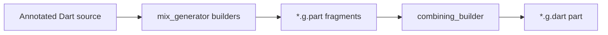

import { Callout } from "nextra/components";

# mix_generator

`mix_generator` is a [build_runner](https://pub.dev/packages/build_runner) package that turns Mix annotations into the repetitive code you should not have to maintain by hand. It can complete Specs, create Stylers, implement Mix properties and modifiers, and turn a named Styler into a reusable Flutter widget.

## What gets generated

The package registers **six builders** (see [`build.yaml` in the Mix repo](https://github.com/btwld/mix/blob/main/packages/mix_generator/build.yaml)):

| Builder | Triggers on | Generated part (suffix) | Output |
|---------|-------------|-------------------------|-------------------|
| `mix_generator` | `@MixableSpec` | `.mix_generator.g.part` | Completes the immutable Spec contract |
| `spec_styler_generator` | `@MixableSpec(target: …)` | `.spec_styler_generator.g.part` | Creates a full fluent Styler class |
| `styler_generator` | `@MixableStyler` | `.styler_generator.g.part` | Supports legacy handwritten Stylers |
| `mixable_generator` | `@Mixable` | `.mixable_generator.g.part` | Implements a compound Mix property |
| `mix_widget_generator` | `@MixWidget` | `.mix_widget_generator.g.part` | Creates a `StatelessWidget` around a Styler |
| `modifier_generator` | `@MixableModifier` | `.modifier_generator.g.part` | Completes a modifier and its Mix type |

[`source_gen`](https://pub.dev/packages/source_gen) combines these parts into your hand-authored `part '…g.dart';` library.



## Installation

Add runtime and dev dependencies:

```bash
flutter pub add mix mix_annotations
flutter pub add dev:build_runner dev:mix_generator
```

Minimal `pubspec.yaml` shape:

```yaml
dependencies:
  mix: ^2.1.0
  mix_annotations: ^2.1.3

dev_dependencies:
  build_runner: ^2.11.0
  mix_generator: ^2.1.3
```

Versions should match what your Mix release expects; check the [changelog](https://github.com/btwld/mix/blob/main/packages/mix_generator/CHANGELOG.md) when upgrading.

## Running code generation

From your package root:

```bash
dart run build_runner build --delete-conflicting-outputs
```

During development, watch mode regenerates on save:

```bash
dart run build_runner watch --delete-conflicting-outputs
```

Contributors working inside the Mix repository often use `melos run gen:build` to run the repo’s codegen scripts across packages.

## Annotations (from `mix_annotations`)

### `@MixWidget`

Use `@MixWidget` when a named Styler should become part of your widget API. The generator derives the widget name from a top-level lower-camel-case identifier ending in `Style`: `appCardStyle` becomes `AppCard`.

Here is the complete handwritten file:

```dart filename="app_card.dart"
import 'package:flutter/material.dart';
import 'package:mix/mix.dart';
import 'package:mix_annotations/mix_annotations.dart';

part 'app_card.g.dart';

@MixWidget()
final appCardStyle = BoxStyler()
    .color(Colors.deepPurple)
    .paddingAll(16)
    .borderRounded(12);
```

Run the builder:

```bash
dart run build_runner build --delete-conflicting-outputs
```

The generated part contains a normal Flutter widget. This excerpt is the relevant output:

```dart filename="app_card.g.dart"
class AppCard extends StatelessWidget {
  const AppCard({super.key, this.child});

  final Widget? child;

  @override
  Widget build(BuildContext context) {
    return appCardStyle.call(
      key: this.key,
      child: this.child,
    );
  }
}
```

Use the generated type like any other widget:

```dart
const AppCard(
  child: Text('Generated from one Styler'),
);
```

No parameter configuration is needed here: a variable-backed `BoxStyler` generates the `key` and `child` widget surface shown above. Use `@MixWidget(name: 'Surface')` when the derived name is not the API you want.

<Callout type="info">
  `@MixWidget` requires an unprefixed Flutter widgets import because the generated part uses `Widget`, `StatelessWidget`, and `BuildContext` from the host library.
</Callout>

Function-backed styles work too. Factory parameters become widget constructor parameters, and a non-nullable enum parameter named `variant` can generate named constructors such as `Button.solid()` and `Button.ghost()`.

### `@MixableSpec`

Use on immutable **Spec** classes. The generated mixin completes the `Spec<T>` contract and can include `copyWith`, equality, interpolation, and diagnostics. Integer flags in `GeneratedSpecMethods` and `GeneratedSpecComponents` control the emitted surface.

```dart
import 'package:flutter/foundation.dart';
import 'package:mix/mix.dart';
import 'package:mix_annotations/mix_annotations.dart';

part 'my_spec.g.dart';

@MixableSpec()
@immutable
final class MySpec with _$MySpec {
  @override
  final String? name;
  @override
  final int? age;

  const MySpec({this.name, this.age});
}
```

Flags let you skip generation you do not need, for example:

- `GeneratedSpecMethods.skipLerp` — omit `lerp`
- `GeneratedSpecMethods.skipCopyWith` — omit `copyWith`

Add `target: YourWidget.new` when the generator should also create the matching Styler class from the Spec.

### `@MixableStyler` (legacy)

`@MixableStyler` remains available for handwritten Styler classes created before spec-driven generation. New Stylers should normally come from `@MixableSpec(target: YourWidget.new)`, which generates the fields, constructors, fluent methods, `call()`, merge, resolve, diagnostics, and props together.

See [`BoxSpec`](https://github.com/btwld/mix/blob/main/packages/mix/lib/src/specs/box/box_spec.dart) and its generated part in the Mix repository for a current spec-driven reference.

<Callout type="info">
  When maintaining a legacy handwritten Styler, follow the same constructor patterns as core Mix Stylers. The [mix_lint](/documentation/mix/ecosystem/mix-lint) rule `mix_mixable_styler_has_create` enforces a `const` `.create` constructor for `@MixableStyler` classes.
</Callout>

### `@MixableField`

Annotate individual `Prop<…>` fields on a Styler when you need to:

- **`ignoreSetter: true`** — no fluent setter generated for that field.
- **`setterType:`** — override the setter parameter type when it must differ from `Prop<T>`’s type argument.

### `@Mixable`

Use on **property / constraint** classes (types extending Mix’s property bases) so the builder emits `merge`, `resolve`, equality-related `props`, and diagnostics. Optional **`resolveToType`** supplies the target type name when it cannot be inferred from the superclass.

`GeneratedMixMethods` flags control whether `merge`, `resolve`, `props`, or `debugFillProperties` are emitted.

## Authoring `part` files

Point your library at the generated part Dart will pull in:

```dart
part 'box_spec.g.dart';
```

After a successful build, `box_spec.g.dart` contains the `part of` directive and the combined output from the relevant builders. If generation fails, fix analyzer errors in the annotated file first—generators depend on resolved types.

## Troubleshooting

- **No output / stale errors:** Run `build_runner` with `--delete-conflicting-outputs` if a previous run left incompatible `*.g.dart` files.
- **Builder not running:** Ensure `mix_generator` is in `dev_dependencies` and that your package (or app) imports files that carry the annotations; builders only visit included sources.
- **Monorepo `build.yaml`:** The Mix framework repo narrows `generate_for` globs for its own layout. **Your app** typically relies on the builders’ `auto_apply: dependents` behavior unless you add a custom `build.yaml`.

## Debugging the generator

To step through generator code in this repository, use the VS Code **Debug build_runner** launch configuration under `packages/mix_generator`, or run build_runner with the VM service enabled and attach a debugger (see the package README in `packages/mix_generator`).

## Related docs

- [mix_lint](/documentation/mix/ecosystem/mix-lint) — Mix-specific analyzer rules, including Styler structure
- [Styling guide](/documentation/mix/guides/styling) — how Spec, Styler, and widgets fit together
- [API composition guidelines](https://github.com/btwld/mix/blob/main/guides/api-composition-guidelines.md) — fluent chaining and merge patterns (repository guide)
