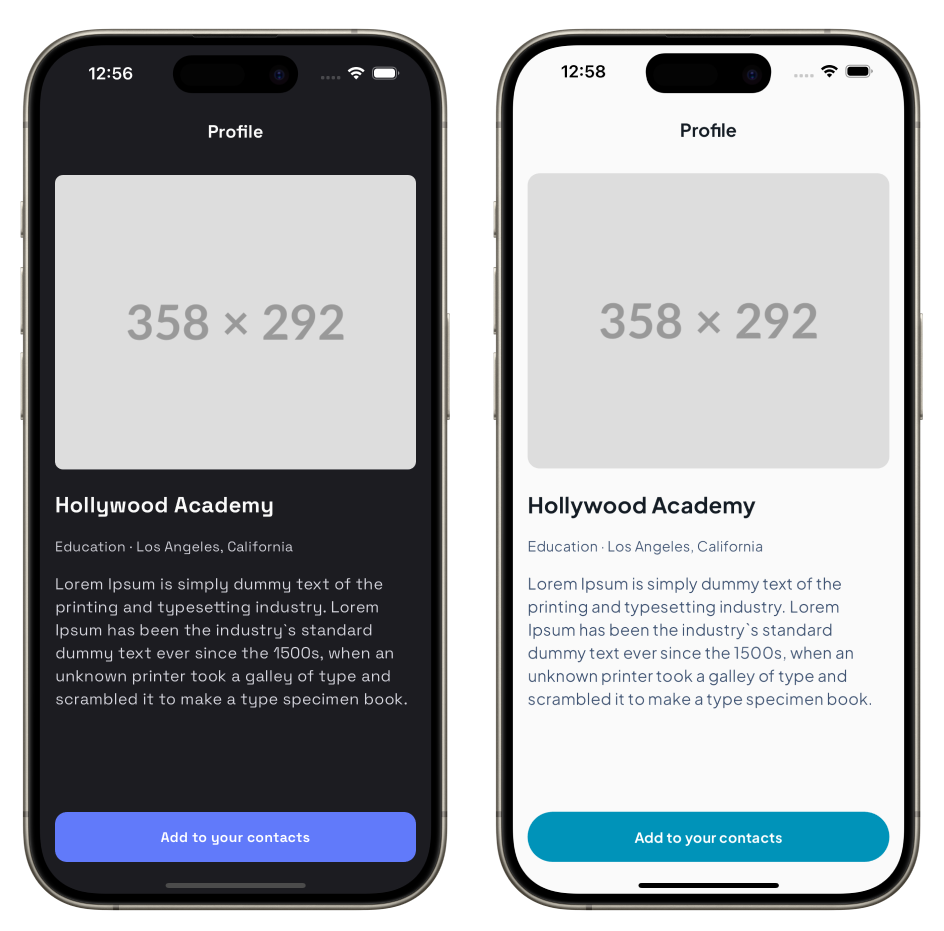
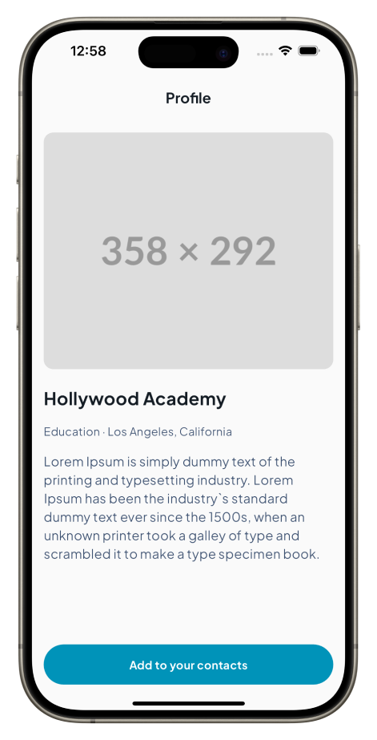

# Theming

## Introduction

Mix helps you keep colors, typography, spacing, and radii consistent by referencing **design tokens** instead of scattering literals through your widgets.

A **token** is a typed key (for example `ColorToken('primary')`). You map each token to a concrete value (`Color`, `TextStyle`, `double`, and so on) and provide those maps from a single ancestor, `MixScope`. When you change the maps—light vs dark, brand A vs brand B—everything that reads tokens updates together.

In this tutorial you will build one profile screen and two full themes: **`LightBlueTheme`** (light surface, blue primary, Roboto) and **`DarkPurpleTheme`** (dark surface, purple primary, Courier). You will then swap token maps at runtime.

## Prerequisites

- [Creating a Widget](/documentation/tutorials/creating-a-widget) — `BoxStyler`, `TextStyler`, and callable stylers
- [Design Tokens](/documentation/guides/design-token) — deeper reference for `MixScope` and token types

## Getting Started

The **interactive preview** below is a compact demo: nested `MixScope` widgets override token values for part of the subtree.

The **screenshots** show the profile screen you will build in this tutorial—**`LightBlueTheme`** on the left and **`DarkPurpleTheme`** on the right, with different colors, typefaces, and radii.

<FlutterPreview previewId="tutorials/theming.0" title="Nested MixScope and tokens" description="Outer and inner MixScope supply different token maps to their descendants." height={280} />



## Setting Up MixScope

`MixScope` is an ancestor that supplies token maps to descendants. Wrap the part of the tree that should share the same theme (often the root, above `MaterialApp`).

Here's how to initialize `MixScope`:

### Wrapping the Root Widget

To apply your theme globally, you'll want to wrap your application's widgets with the `MixScope` widget, providing token values through named parameters.

```dart
class MyApp extends StatelessWidget {
  const MyApp({super.key});

  @override
  Widget build(BuildContext context) {
    return MixScope(
      colors: LightBlueTheme.colors,
      textStyles: LightBlueTheme.textStyles,
      radii: LightBlueTheme.radii,
      spaces: LightBlueTheme.spaces,
      child: const MaterialApp(
        home: ProfilePage(),
      ),
    );
  }
}
```

### Creating Design Tokens

Define your tokens next. This tutorial uses `ColorToken`, `TextStyleToken`, `SpaceToken`, and `RadiusToken`. Mix also provides **`BreakpointToken`** for responsive layouts; see [Design Tokens](/documentation/guides/design-token).

The recommended way to organize tokens is Dart enums: type safety, autocomplete, and a clear API. For example:

```dart
enum CustomColorTokens {
  primary('primary'),
  onPrimary('on-primary'),
  surface('surface'),
  onSurface('on-surface'),
  onSurfaceVariant('on-surface-variant');

  final String name;
  const CustomColorTokens(this.name);

  ColorToken get token => ColorToken(name);
}

enum CustomTextStyleTokens {
  headline1('headline1'),
  headline2('headline2'),
  button('button'),
  body('body'),
  callout('callout');

  final String name;
  const CustomTextStyleTokens(this.name);

  TextStyleToken get token => TextStyleToken(name);
}

enum MyThemeRadiusToken {
  large('large'),
  medium('medium');

  final String name;
  const MyThemeRadiusToken(this.name);

  RadiusToken get token => RadiusToken(name);
}

enum MyThemeSpaceToken {
  medium('medium'),
  large('large');

  final String name;
  const MyThemeSpaceToken(this.name);

  SpaceToken get token => SpaceToken(name);
}
```

With this approach, you access tokens like this:

```dart
final primaryColorToken = CustomColorTokens.primary.token;
final headline1TextStyleToken = CustomTextStyleTokens.headline1.token;
```

### Creating Theme Data

Now that we have our tokens defined, we need to create theme classes that map tokens to their actual values. We'll organize these as static maps within theme classes. This makes it easy to switch between themes.

Here's the `LightBlueTheme`:

```dart
class LightBlueTheme {
  static Map<ColorToken, Color> get colors => {
    CustomColorTokens.primary.token: const Color(0xFF0093B9),
    CustomColorTokens.onPrimary.token: const Color(0xFFFAFAFA),
    CustomColorTokens.surface.token: const Color(0xFFFAFAFA),
    CustomColorTokens.onSurface.token: const Color(0xFF141C24),
    CustomColorTokens.onSurfaceVariant.token: const Color(0xFF405473),
  };

  static Map<TextStyleToken, TextStyle> get textStyles => {
    CustomTextStyleTokens.headline1.token: const TextStyle(
      fontSize: 22,
      fontWeight: FontWeight.bold,
      fontFamily: 'Roboto',
    ),
    CustomTextStyleTokens.headline2.token: const TextStyle(
      fontSize: 18,
      fontWeight: FontWeight.bold,
      fontFamily: 'Roboto',
    ),
    CustomTextStyleTokens.button.token: const TextStyle(
      fontSize: 14,
      fontWeight: FontWeight.bold,
      fontFamily: 'Roboto',
    ),
    CustomTextStyleTokens.body.token: const TextStyle(
      fontSize: 16,
      fontWeight: FontWeight.normal,
      fontFamily: 'Roboto',
    ),
    CustomTextStyleTokens.callout.token: const TextStyle(
      fontSize: 14,
      fontWeight: FontWeight.normal,
      fontFamily: 'Roboto',
    ),
  };

  static Map<RadiusToken, Radius> get radii => {
    MyThemeRadiusToken.large.token: const Radius.circular(100),
    MyThemeRadiusToken.medium.token: const Radius.circular(12),
  };

  static Map<SpaceToken, double> get spaces => {
    MyThemeSpaceToken.medium.token: 16,
    MyThemeSpaceToken.large.token: 24,
  };
}
```

And the `DarkPurpleTheme`:

```dart
class DarkPurpleTheme {
  static Map<ColorToken, Color> get colors => {
    CustomColorTokens.primary.token: const Color(0xFF617AFA),
    CustomColorTokens.onPrimary.token: const Color(0xFFFAFAFA),
    CustomColorTokens.surface.token: const Color(0xFF1C1C21),
    CustomColorTokens.onSurface.token: const Color(0xFFFAFAFA),
    CustomColorTokens.onSurfaceVariant.token: const Color(0xFFD6D6DE),
  };

  static Map<TextStyleToken, TextStyle> get textStyles => {
    CustomTextStyleTokens.headline1.token: const TextStyle(
      fontSize: 22,
      fontWeight: FontWeight.bold,
      fontFamily: 'Courier',
    ),
    CustomTextStyleTokens.headline2.token: const TextStyle(
      fontSize: 18,
      fontWeight: FontWeight.bold,
      fontFamily: 'Courier',
    ),
    CustomTextStyleTokens.button.token: const TextStyle(
      fontSize: 14,
      fontWeight: FontWeight.bold,
      fontFamily: 'Courier',
    ),
    CustomTextStyleTokens.body.token: const TextStyle(
      fontSize: 16,
      fontWeight: FontWeight.normal,
      fontFamily: 'Courier',
    ),
    CustomTextStyleTokens.callout.token: const TextStyle(
      fontSize: 14,
      fontWeight: FontWeight.normal,
      fontFamily: 'Courier',
    ),
  };

  static Map<RadiusToken, Radius> get radii => {
    MyThemeRadiusToken.large.token: const Radius.circular(12),
    MyThemeRadiusToken.medium.token: const Radius.circular(8),
  };

  static Map<SpaceToken, double> get spaces => {
    MyThemeSpaceToken.medium.token: 16,
    MyThemeSpaceToken.large.token: 24,
  };
}
```

## Creating the UI

Now that we have defined our themes, we can start creating the UI for our application. We will create a simple profile page with an image and some text, and then apply the themes to the UI.

### Creating the Components

The interface chosen for this guide is quite simple. The only custom component is a button, so let's create that first.

```dart
class ProfileButton extends StatelessWidget {
  const ProfileButton({super.key, required this.label});

  final String label;

  @override
  Widget build(BuildContext context) {
    // Create a box styler with tokens
    final box = BoxStyler
        .height(50)
        .width(double.infinity)
        .color(CustomColorTokens.primary.token())
        .alignment(.center)
        .borderRadiusAll(MyThemeRadiusToken.large.token());

    // Create a text styler with tokens
    final text = TextStyler
        .style(CustomTextStyleTokens.button.token.mix())
        .color(CustomColorTokens.onPrimary.token());

    // Use stylers as callable functions
    return box(child: text(label));
  }
}
```

This code demonstrates several key concepts:

1. **Token calling**: Call tokens as functions with `token()` to get token references for use in stylers
2. **TextStyle tokens**: Use `.token.mix()` for text style tokens to get the Mix-compatible reference
3. **Callable stylers**: Mix stylers can be called like functions, passing the child widget directly
4. **Fluent API**: Chain styling methods for clean, readable code

### Creating the ProfilePage

Now that we have built the `ProfileButton`, we can create the `ProfilePage` widget. It combines Mix widgets (`StyledText`, `ColumnBox`, and stylers) with Flutter’s `Scaffold` and `AppBar`. Those Mix types come from `package:mix/mix.dart`.

Optional **`onThemeToggle`** / **`useDarkTheme`** parameters show how to wire a control that lives in the parent `State` (next section).

```dart
class ProfilePage extends StatelessWidget {
  const ProfilePage({
    super.key,
    this.onThemeToggle,
    this.useDarkTheme = false,
  });

  final VoidCallback? onThemeToggle;
  final bool useDarkTheme;

  @override
  Widget build(BuildContext context) {
    // AppBar title styling
    final appBarTitle = TextStyler
        .style(CustomTextStyleTokens.headline2.token.mix())
        .color(CustomColorTokens.onSurface.token());

    // Layout styling with FlexBoxStyler
    final flexBox = FlexBoxStyler
        .crossAxisAlignment(.start)
        .marginAll(MyThemeSpaceToken.medium.token())
        .spacing(MyThemeSpaceToken.medium.token());

    return Scaffold(
      backgroundColor: CustomColorTokens.surface.token.resolve(context),
      appBar: AppBar(
        backgroundColor: CustomColorTokens.surface.token.resolve(context),
        title: appBarTitle('Profile'),
        centerTitle: false,
        actions: [
          if (onThemeToggle != null)
            IconButton(
              tooltip: 'Toggle theme',
              icon: Icon(
                useDarkTheme ? Icons.light_mode : Icons.dark_mode,
              ),
              onPressed: onThemeToggle,
            ),
        ],
      ),
      body: SafeArea(
        child: ColumnBox(
          style: flexBox,
          children: [
            // Image placeholder
            ImagePlaceholder(),
            // Title
            StyledText(
              'Hollywood Academy',
              style: TextStyler
                  .style(CustomTextStyleTokens.headline1.token.mix())
                  .color(CustomColorTokens.onSurface.token()),
            ),
            // Subtitle
            StyledText(
              'Education · Los Angeles, California',
              style: TextStyler
                  .style(CustomTextStyleTokens.callout.token.mix())
                  .color(CustomColorTokens.onSurfaceVariant.token()),
            ),
            // Description
            StyledText(
              'Lorem Ipsum is simply dummy text of the printing and typesetting industry.',
              style: TextStyler
                  .style(CustomTextStyleTokens.body.token.mix())
                  .color(CustomColorTokens.onSurfaceVariant.token()),
            ),
            const Spacer(),
            // Button
            const ProfileButton(label: 'Add to your contacts'),
          ],
        ),
      ),
    );
  }
}

class ImagePlaceholder extends StatelessWidget {
  const ImagePlaceholder({super.key});

  @override
  Widget build(BuildContext context) {
    final imageContainer = BoxStyler
        .height(200)
        .width(double.infinity)
        .color(CustomColorTokens.primary.token())
        .borderRadiusAll(MyThemeRadiusToken.medium.token());

    final icon = IconStyler
        .size(80)
        .color(CustomColorTokens.onPrimary.token());

    return imageContainer(child: icon(icon: Icons.image));
  }
}
```

Key points about this implementation:

1. **ColumnBox**: Use Mix's `ColumnBox` with `FlexBoxStyler` for layout control with token-based spacing
2. **Token resolution**: For native Flutter widgets like Scaffold and AppBar, use `.resolve(context)` to get actual values
3. **Callable stylers**: Text stylers can be called as functions to create styled text widgets
4. **Component composition**: Break down complex UIs into smaller, reusable components like `ImagePlaceholder`
5. **Theme toggle**: When `onThemeToggle` is non-null, the AppBar shows an icon that calls back into the parent `State`—the same place that swaps token maps in [Switching Between Themes](#switching-between-themes)

The app root already supplies tokens through `MixScope` (see [Wrapping the Root Widget](#wrapping-the-root-widget)).



## Switching Between Themes

One of the powerful features of Mix's theming system is the ability to switch themes dynamically. Here's how you can implement theme switching:

```dart
class ThemingTutorialApp extends StatefulWidget {
  const ThemingTutorialApp({super.key});

  @override
  State<ThemingTutorialApp> createState() => _ThemingTutorialAppState();
}

class _ThemingTutorialAppState extends State<ThemingTutorialApp> {
  bool _isDarkPurpleTheme = false;

  @override
  Widget build(BuildContext context) {
    // Select theme based on state
    final colors = _isDarkPurpleTheme 
        ? DarkPurpleTheme.colors 
        : LightBlueTheme.colors;
    final textStyles = _isDarkPurpleTheme
        ? DarkPurpleTheme.textStyles
        : LightBlueTheme.textStyles;
    final radii = _isDarkPurpleTheme 
        ? DarkPurpleTheme.radii 
        : LightBlueTheme.radii;
    final spaces = _isDarkPurpleTheme 
        ? DarkPurpleTheme.spaces 
        : LightBlueTheme.spaces;

    return MixScope(
      colors: colors,
      textStyles: textStyles,
      radii: radii,
      spaces: spaces,
      child: ProfilePage(
        onThemeToggle: () =>
            setState(() => _isDarkPurpleTheme = !_isDarkPurpleTheme),
        useDarkTheme: _isDarkPurpleTheme,
      ),
    );
  }
}
```

Call `setState` when the user triggers `onThemeToggle` (here, the AppBar **icon**). Every widget that reads tokens under this `MixScope` rebuilds with the new maps.

For a static app, omit `onThemeToggle` and keep `const ProfilePage()` as in [Wrapping the Root Widget](#wrapping-the-root-widget).

## Key Takeaways

Mix's theming system provides:

1. **Type-safe tokens**: Enum-based tokens with compile-time safety and autocomplete support
2. **Easy theme switching**: Change themes by updating token value maps
3. **Consistent styling**: Tokens ensure design consistency across your entire app
4. **Fluent API**: Chainable stylers with callable functions for clean code
5. **Flexible integration**: Works seamlessly with both Mix widgets and native Flutter widgets

## Best Practices

- **Organize tokens by category**: Use separate enums for colors, text styles, radii, and spacing
- **Use static theme classes**: Keep theme data organized in classes with static getters
- **Leverage callable stylers**: Use stylers as functions for concise component code
- **Compose components**: Break down UIs into smaller, reusable styled components
- **Mix with Flutter**: Use Mix for your design system components, native Flutter widgets where appropriate

## Next steps

- [Design Tokens](/documentation/guides/design-token) — `MixScope`, breakpoints, and token patterns in depth
- [Dynamic Styling](/documentation/guides/dynamic-styling) — variants that react to context (dark mode, hover, and more)
